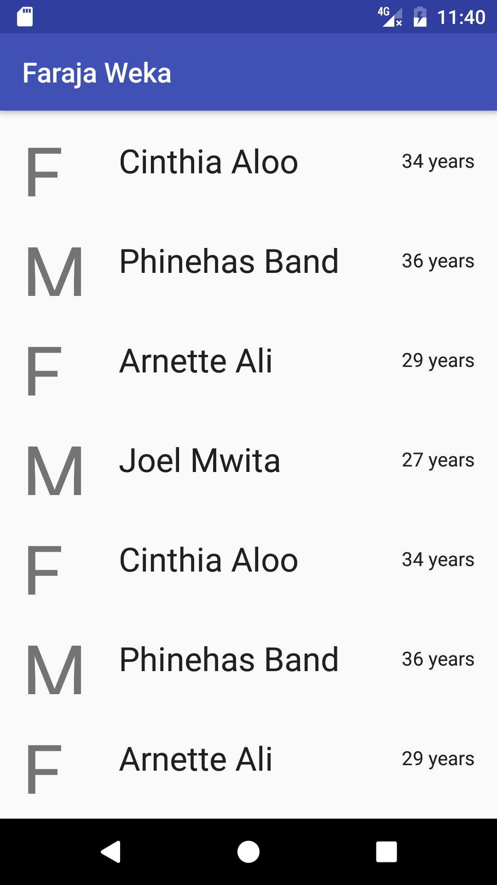
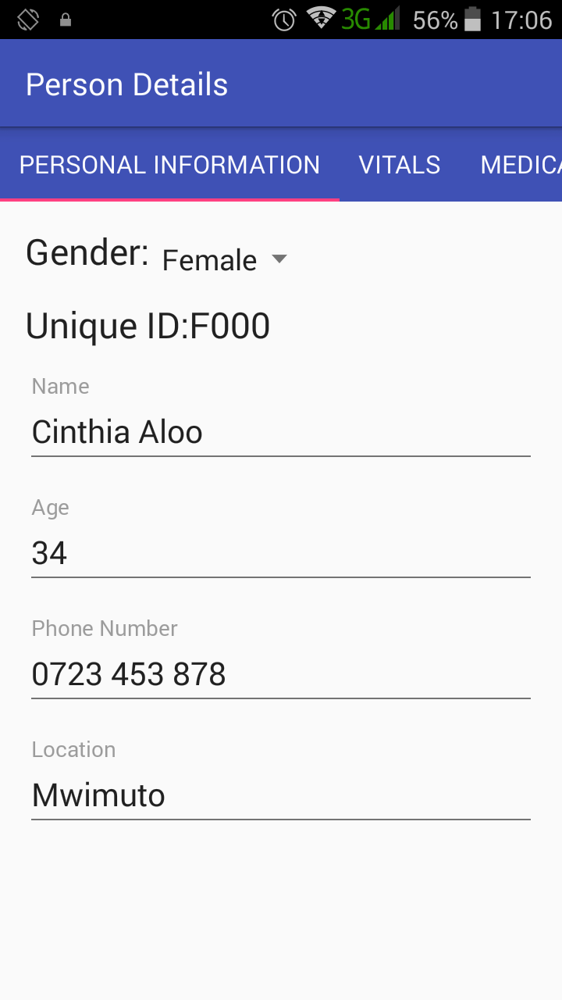

# Faraja Weka

##Introduction

A ***currently in demonstration stage*** Android app for the Faraja Cancer Support Trust's cancer screening initiative. The Faraja homepage is https://farajacancersupport.org/. 

## Version History :package:

**Click this link for the latest version:** 	[Faraja Weka v0.1-alpha](https://github.com/joshua-kairu/faraja-weka/releases/download/v0.1-alpha/faraja-weka-v0.1-alpha.apk) (Tuesday, 24. January 2017)


This repo tries its best to follow the [Semantic Versioning](http://semver.org/) guidelines.

## How To Use :wrench:

When you open up the app, you'll see a list that looks like this:

 

This list is divided horizontally. Each list item is made of three components. Starting from the leftmost, we have:

* A letter representing the person's gender. `M` for Male and `F` for Female.
* The person's name
* The person's age

Selecting an individual from the list will take you to a screen that looks like the following:

 

This screen holds the individual's details. 

Below the `Person Details` bar is a Tab bar that organizes the person's details into the following entries:

* Personal Information
* Vitals
* Medical history
* Examinations
* Referrals

Some tabs are not visible in the screenshot because they could not fit in the screen. However, they can be accessed by scrolling the tabs from right to left.

We will consider each tab at a time.

###1. Personal Information Tab

The Personal Information tab looks as follows(*Spoiler Alert: It's the same as the person details screen:-)*):

 

This is the tab seen the first time one gets to the details section.

It holds the person's personal details, such as name, age, and gender.

###2. Vitals Tab

Here is how the Vitals tab looks like:

 

It holds fields for entering the person's vitals, like BMI, blood pressure, and blood glucose.

###3. Medical History tab

This tab varies based on gender since different medical histories are needed for different genders

For **males**, medical history taken includes histories of cancer, cancer in the family, and smoking cigarettes. The tab looks as follows:

 

For **females**, medical history taken includes histories of pregrancy and children, as well as those in the males section. The tab looks as follows:

 

###4. Examinations tab

The examinations tab also varies based on gender.

**Males** are asked about results of breast and prostate examinations, as seen below:

 

**Females** will need to provide information about how their breast and cervical examinations went. This section can be seen below:

 

###5. Referrals tab

Last but definitely not least is the referrals tab. 

It contains a simple text field where a person's referrals can be entered.

Here is the referrals screen:

 

## Abilities :muscle:

The app allows users to:
* See a mock list of screened persons.
* View an individual person's screening details.

## Limitations :worried:

Some limits are:
* A new person cannot be added to the list of persons.
* Any edits to a person's details are not stored in memory.

## Possible Future Work :fast_forward:

- [ ] Allow users to add and change screened individuals at will.

- [ ] Store all person details in memory.

## Other things :books:

Nothing at the moment. :smile:

## License :lock_with_ink_pen:

```
Copyright 2017 Joshua Kairu

Licensed under the Apache License, Version 2.0 (the "License");
you may not use this file except in compliance with the License.
You may obtain a copy of the License at

    http://www.apache.org/licenses/LICENSE-2.0

Unless required by applicable law or agreed to in writing, software
distributed under the License is distributed on an "AS IS" BASIS,
WITHOUT WARRANTIES OR CONDITIONS OF ANY KIND, either express or implied.
See the License for the specific language governing permissions and
limitations under the License.
```